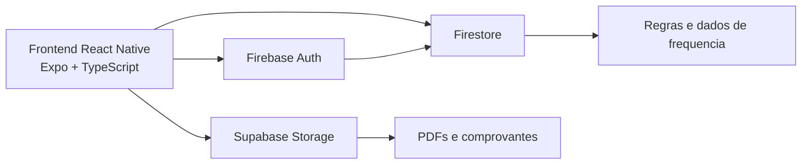
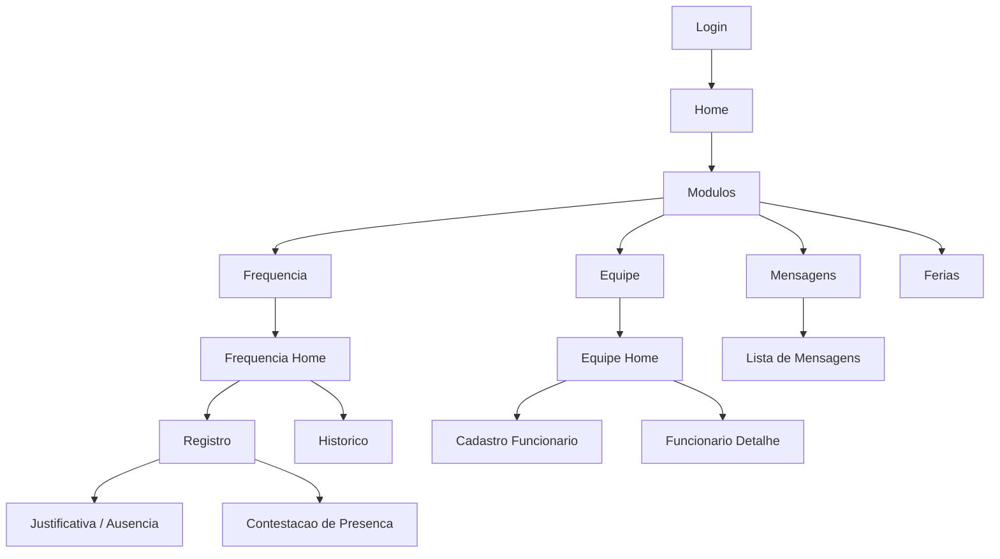

# DOCUMENTACAO DO SISTEMA MOBILE

## 1. VISION GERAL DO PROJETO

O sistema e um aplicativo mobile desenvolvido em React Native com Expo para apoio as rotinas operacionais de frequencia funcional, gestao de registros diários, justificativas, contestacao de presenca e emissao de folha mensal.

O objetivo principal e permitir que colaborador e gestor executem os fluxos de ponto e acompanhamento em um unico app, com persistencia em Firebase Firestore, autenticacao via Firebase Authentication e armazenamento de PDFs no Supabase Storage.

Nao existe backend proprio em Node.js, FastAPI ou Django neste projeto. A camada de backend e composta por servicos gerenciados de Firebase e Supabase, consumidos diretamente pelo app mobile.

## 2. CODIGO FRONTEND (React Native)

### 2.1 Estrutura de navegacao

O projeto usa React Navigation com uma navegacao raiz que alterna entre fluxo autenticado e nao autenticado.

```tsx
// src/navigation/RootNavigator.tsx
import { NavigationContainer, DefaultTheme } from '@react-navigation/native';

import { useAuth } from '../hooks/useAuth';
import { theme } from '../utils/theme';
import { AppNavigator } from './AppNavigator';
import { AuthNavigator } from './AuthNavigator';

// Tema visual da navegacao, alinhado com a identidade do app.
const navigationTheme = {
  ...DefaultTheme,
  colors: {
    ...DefaultTheme.colors,
    background: theme.colors.background,
    card: theme.colors.surface,
    text: theme.colors.text,
    primary: theme.colors.primary,
    border: theme.colors.border,
  },
};

export function RootNavigator() {
  const { firebaseUser } = useAuth();

  // Se o usuario estiver autenticado, entra na area interna do app.
  return <NavigationContainer theme={navigationTheme}>{firebaseUser ? <AppNavigator /> : <AuthNavigator />}</NavigationContainer>;
}
```

```tsx
// src/navigation/AppNavigator.tsx
import { createNativeStackNavigator } from '@react-navigation/native-stack';

import { HomeScreen } from '../screens/home/HomeScreen';
import { ModulosScreen } from '../screens/home/ModulosScreen';
import { FeriasScreen } from '../screens/ferias/FeriasScreen';
import { MensagensScreen } from '../screens/messages/MensagensScreen';
import { theme } from '../utils/theme';
import { EquipeNavigator } from './EquipeNavigator';
import { FrequenciaNavigator } from './FrequenciaNavigator';
import { AppStackParamList } from './types';

const Stack = createNativeStackNavigator<AppStackParamList>();

export function AppNavigator() {
  return (
    <Stack.Navigator
      initialRouteName="Home"
      screenOptions={{
        headerStyle: { backgroundColor: theme.colors.surface },
        headerTitleStyle: { color: theme.colors.text, fontWeight: '700' },
        contentStyle: { backgroundColor: theme.colors.background },
      }}
    >
      {/* Tela inicial do usuario autenticado */}
      <Stack.Screen component={HomeScreen} name="Home" options={{ headerShown: false }} />
      {/* Catalogo de modulos */}
      <Stack.Screen component={ModulosScreen} name="Modulos" options={{ title: 'Módulos' }} />
      {/* Caixa de mensagens e alertas operacionais */}
      <Stack.Screen component={MensagensScreen} name="MensagensModule" options={{ title: 'Mensagens' }} />
      {/* Stack especifica do fluxo de frequencia */}
      <Stack.Screen component={FrequenciaNavigator} name="FrequenciaModule" options={{ headerShown: false }} />
      <Stack.Screen component={FeriasScreen} name="FeriasModule" options={{ title: 'Férias' }} />
      <Stack.Screen component={EquipeNavigator} name="EquipeModule" options={{ headerShown: false }} />
    </Stack.Navigator>
  );
}
```

### 2.2 Principais componentes de tela

A tela inicial organiza resumo mensal, foto de perfil e atalhos operacionais.

```tsx
// src/screens/home/HomeScreen.tsx
import { useCallback, useEffect, useState } from 'react';
import { Alert, Image, Platform, Pressable, StyleSheet, Text, View } from 'react-native';

import { useAuth } from '../../hooks/useAuth';
import { profilePhotoService } from '../../services/profilePhotoService';
import { userService } from '../../services/userService';
import { useMonthlySummary } from '../../hooks/useMonthlySummary';
import { getTodayKey } from '../../utils/date';

export function HomeScreen({ navigation }) {
  const { patchProfile, profile } = useAuth();
  const [displayedPhotoUri, setDisplayedPhotoUri] = useState<string | null>(null);
  const { records, workedDays, missedDays, justifiedDays, refresh } = useMonthlySummary(profile?.id);

  // Abre o registro de hoje no fluxo de frequencia.
  const openTodayRecord = () => {
    navigation.navigate('FrequenciaModule', {
      screen: 'Registro',
      params: {
        date: getTodayKey(),
        userId: profile?.id,
      },
    });
  };

  // Atualiza foto de perfil e sincroniza com o backend.
  const saveProfilePhoto = async (uri: string) => {
    if (!profile?.id) return;

    const photoUrl = await profilePhotoService.uploadProfilePhoto(uri);
    setDisplayedPhotoUri(photoUrl);
    await profilePhotoService.cacheProfilePhoto(profile.id, photoUrl);
    await userService.updateProfilePhoto(profile.id, photoUrl);
    patchProfile({ fotoPerfilUri: photoUrl });
  };
}
```

### 2.3 Hooks personalizados

O projeto usa hooks proprios para centralizar acesso ao contexto autenticado e ao resumo mensal.

```tsx
// src/hooks/useAuth.ts
import { useContext } from 'react';

import { AuthContext } from '../contexts/AuthContext';

export const useAuth = () => {
  const context = useContext(AuthContext);

  if (!context) {
    throw new Error('useAuth deve ser usado dentro de AuthProvider.');
  }

  return context;
};
```

```tsx
// src/hooks/useMonthlySummary.ts
import { useCallback, useEffect, useState } from 'react';

export function useMonthlySummary(userId?: string) {
  const [records, setRecords] = useState([]);
  const [expectedDays, setExpectedDays] = useState(0);

  const refresh = useCallback(async () => {
    if (!userId) {
      setRecords([]);
      return;
    }

    // Carrega registros do mes e calcula dias esperados.
    const [remoteRecords, policies] = await Promise.all([
      frequenciaService.getMonthlyRecords(month, year, { userId }),
      calendarService.getMonthlyPolicies(month, year),
    ]);
    setRecords(remoteRecords);
  }, [userId]);

  useEffect(() => {
    refresh().catch(() => undefined);
  }, [refresh]);
}
```

### 2.4 Servicos de API no frontend

O frontend consome Firebase e Supabase por meio de servicos dedicados. O fluxo de frequencia e o principal consumidor de dados.

```tsx
// src/screens/frequencia/RegistroScreen.tsx
const handleDeclareAbsence = async () => {
  if (!profile || !targetUserId) {
    Alert.alert('Aguarde', 'Ainda estamos carregando seu perfil. Tente novamente em instantes.');
    return;
  }

  if (!absenceReason.trim()) {
    Alert.alert('Validação', 'Descreva a justificativa da ausencia.');
    return;
  }

  if (!attachedPdf) {
    Alert.alert('Validação', 'Anexe um comprovante em PDF para efetivar a ausencia.');
    return;
  }

  // Envia o PDF ao Supabase e atualiza o registro no Firestore.
  const storagePath = await absenceDocumentService.uploadAbsencePdf({
    date,
    fileName: attachedPdf.name,
    fileUri: attachedPdf.uri,
    mimeType: attachedPdf.mimeType,
    userId: targetUserId,
  });
};
```

## 3. CODIGO BACKEND / API

### 3.1 Observacao importante

Este projeto nao possui backend proprio em Node.js, FastAPI ou Django. A camada de API e composta pelos servicos do Firebase e do Supabase. Por isso, os trechos abaixo mostram a integracao real do app com esses servicos.

### 3.2 Conexao e configuracao Firebase

```ts
// src/services/firebase.ts
import AsyncStorage from '@react-native-async-storage/async-storage';
import Constants from 'expo-constants';
import { FirebaseApp, FirebaseOptions, getApp, getApps, initializeApp } from 'firebase/app';
import { Auth, initializeAuth } from 'firebase/auth';
import { getReactNativePersistence } from '@firebase/auth';
import { Firestore, getFirestore } from 'firebase/firestore';

// Le primeiro firebaseConfig e depois firebase, para compatibilidade de configuracoes.
const config = (
  Constants.expoConfig?.extra?.firebaseConfig
  ?? Constants.expoConfig?.extra?.firebase
  ?? fallbackConfig
) as ExpoFirebaseConfig;

export const auth: Auth = (() => {
  try {
    return initializeAuth(app, { persistence: getReactNativePersistence(AsyncStorage) });
  } catch {
    const { getAuth } = require('firebase/auth');
    return getAuth(app);
  }
})();
```

### 3.3 Operacoes principais no Firestore

```ts
// src/services/frequenciaService.ts
async function registerPunchRemote(profile: UserProfile, date: string, input?: PunchTimeInput) {
  const dayPolicy = await calendarService.getByDate(date);

  // Bloqueia registro em dias sem expediente.
  if (dayPolicy && !dayPolicy.requerPonto) {
    throw new Error(dayPolicy.motivo ?? 'Este dia está marcado como sem expediente.');
  }

  const saved = await saveRemoteRecord(profile.id, date, profile.id, (existing, now) => {
    // Registra horarios manuais ou usa o horario esperado do perfil.
    if (hasManualTimes(input)) {
      const manualEntry = buildTimestampFromDateAndTime(date, input?.entryTime ?? profile.horarioEntradaEsperado, now);
      const manualExit = buildTimestampFromDateAndTime(date, input?.exitTime ?? profile.horarioSaidaEsperado, now);
      return { action: 'create', next: { ...buildRecordTemplate(profile.id, date, now), horaEntrada: manualEntry, horaSaida: manualExit, status: 'presente' } };
    }

    return { action: 'create', next: { ...buildRecordTemplate(profile.id, date, now), horaEntrada: now, horaSaida: null, status: 'presente' } };
  });

  return saved;
}

async function getRecordByDate(userId: string, date: string) {
  if (await isOnline()) {
    const remoteRecord = await findByUserAndDate(userId, date);
    if (remoteRecord) {
      await offlineService.upsertCachedRecord(remoteRecord);
      return remoteRecord;
    }
  }

  const cachedRecords = await offlineService.getCachedRecords(userId);
  return cachedRecords.find((item) => item.data === date) ?? null;
}
```

### 3.4 Integracao com Supabase Storage

```ts
// src/services/folhaDocumentService.ts
import { getSupabaseClient, supabaseConfig } from './supabase';

const folhaStorageBasePath = 'ausencias/folhas';

export const folhaDocumentService = {
  async uploadFolhaOriginalEmitida(input: UploadFolhaPdfInput) {
    const path = `${folhaStorageBasePath}/original/${input.userId}/${input.year}-${normalizedMonth}/${Date.now()}-${normalizedName}`;

    const { error } = await supabase.storage
      .from(supabaseConfig.absenceBucket)
      .upload(path, buffer, { contentType: input.mimeType || 'application/pdf', upsert: true });

    if (error) {
      throw new Error(`Falha no upload da folha emitida: ${error.message}`);
    }

    return { path, hash };
  },
};
```

### 3.5 Exemplo de resposta JSON

Como nao existe API propria, o exemplo abaixo representa o tipo de documento retornado pelo Firestore ao consultar um registro de frequencia.

```json
{
  "id": "usuario_2026-05-15",
  "userId": "usuario",
  "data": "2026-05-15",
  "horaEntrada": null,
  "horaSaida": null,
  "status": "falta",
  "justificativaTexto": "Consulta medica com comprovante anexado",
  "justificativaCanal": "pdf",
  "justificativaStatus": "em_analise",
  "contestacaoStatus": "sem_contestacao",
  "criadoEm": "2026-05-15T12:00:00.000Z"
}
```

## 4. ARQUITETURA DO SISTEMA



## 5. FLUXO DE NAVEGACAO DO APP



## 6. OBSERVACOES TECNICAS

### 6.1 Organizacao de pastas

O projeto segue organizacao modular em `src/`, com separacao clara entre apresentacao, dominio, servicos, modelos, hooks e utilitarios.

Estrutura relevante:

- `src/screens/`: telas do app
- `src/navigation/`: navegacao
- `src/services/`: integracoes com Firebase, Supabase e persistencia
- `src/hooks/`: hooks reutilizaveis
- `src/models/`: tipos e contratos de dados
- `src/domain/`: regras puras de negocio
- `src/utils/`: funcoes auxiliares

### 6.2 Padrao de consumo de API

O padrao de consumo e baseado em servicos centralizados, nao em chamadas diretas espalhadas pelas telas.

Boas praticas aplicadas:

- separacao entre tela e integracao externa
- tratamento de erro com mensagens padronizadas
- cache offline com reidratacao de `Timestamp`
- operacoes transacionais para registros criticos
- uso de IDs deterministicos para evitar duplicidade

### 6.3 Decisoes de arquitetura

- Firebase Authentication foi usado para login e controle de sessao.
- Firestore foi usado para persistencia dos registros de frequencia, mensagens e folhas mensais.
- Supabase Storage foi usado para PDFs e comprovantes.
- Nao foi criado backend proprio, para reduzir complexidade de infraestrutura e manter o foco no app mobile.
- O fluxo offline foi tratado como requisito de uso real, com fila de acoes e sincronizacao posterior.

### 6.4 Observacoes para auditoria academica

- O codigo real do projeto e coerente com o escopo de um aplicativo mobile corporativo.
- As telas e servicos demonstram desacoplamento razoavel entre interface e persistencia.
- A solucao privilegia servicos gerenciados em vez de API propria.
- O projeto contem pontos importantes de controle de integridade, seguranca e rastreabilidade.

## 7. CONCLUSAO

Este documento registra a estrutura tecnica real do sistema mobile, seus principais fluxos de navegação, suas integracoes com Firebase e Supabase, e as decisoes de arquitetura relevantes para auditoria academica.

O projeto nao possui backend proprio tradicional; a aplicacao consome servicos gerenciados diretamente, com regras de seguranca, persistencia e armazenamento distribuidas entre Firebase e Supabase.